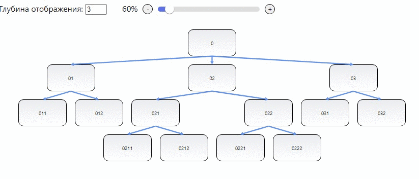

# LinksTreeControl



## Описание

Компонент создан с использованием [The official Redux template for Create-React-App](https://github.com/reduxjs/cra-template-redux) и используется в его контексете. Не содержит логики работы с сервером. Код компонента содержится в катологе **linksTree** и представляет собой "single feature" для папки **features** проекта. 

## Формат входных данных

Пример содержится в файле **linksTree/data.js**

## Зависимости 

Требуются к установке:
1. [react-xarrows](https://www.npmjs.com/package/react-xarrows)
2. [react-input-slider](https://www.npmjs.com/package/react-input-slider)

## Способ использования в проекте

1. Добавить каталог **linksTree** в каталог **src/features** проекта. 
2. Добавить слайс **linksTree** в **store**:
```javascript
export const store = configureStore({
  reducer: {
    // опущены другие слайсы
    linksTree: linksTreeReducer,
  },
});
```
3. Импортировать компонент **LinksTreeControl** из **linksTree/LinksTreeControl.jsx**
4. Использовать LinksTreeControl внутри обертки **Provider**. Например:
```javascript
import { Provider } from 'react-redux'
import { LinksTreeControl } from './features/categories/LinksTreeControl'

ReactDOM.render(
  <Provider store={store}>
    <LinksTreeControl />
  </Provider>,
  document.getElementById('root')
)
```
